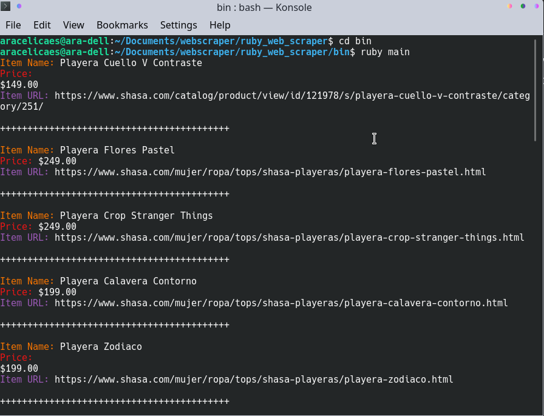

<!-- PROJECT LOGO -->
# Ruby Web Scraper
This Project is a Web Scraper built with Ruby and Nokogiri Gem. This is a Capstone Project for Microverse Inc.

<!-- TABLE OF CONTENTS -->
## Table of Contents
- [Ruby Web Scraper](#ruby-web-scraper)
  - [Table of Contents](#table-of-contents)
- [About The Project](#about-the-project)
  - [Web Scraper in Ruby](#web-scraper-in-ruby)
  - [Live Environment](#live-environment)
  - [Features:](#features)
    - [Built with Ruby](#built-with-ruby)
  - [Built With](#built-with)
- [Getting started](#getting-started)
  - [Installation](#installation)
    - [Automated test](#automated-test)
- [Contact](#contact)
- [Acknowledgements](#acknowledgements)
<!-- ABOUT THE PROJECT -->
# About The Project
## Web Scraper in Ruby
This specific web scraper is built to extract data from The Online Clothing Store [Shasa](https://www.shasa.com/).  The Data to be extracted is:
- The Item Name
- The Item Price
- The Item URL

The reason I chose this website, is because I love online shopping. However, Online shopping can be quite annoying sometimes, because it just throws everything at you. So web scraping simplifies that task by allowing me to scrape what I love the most from a clothing store...T-SHIRTS!

Check out the following console output! <3

## Live Environment
Check out the Live Version we have created for you by clicking on the next link: 
[Go to Live Version](https://gitpod.io/github.com/aracelicaes/ruby_web_scraper)

## Features:
### Built with Ruby
- You can check the scraper using Ruby
## Built With
* Ruby
* Nogogiri Gem[Get Info and Installation Data Here](https://github.com/sparklemotion/nokogiri)
* Colorize Gem[Get Info and Installation Data Here](https://github.com/fazibear/colorize)
* Bundler

<!-- GETTING STARTED -->
# Getting started
## Installation
* Clone the repo following [this link](git@github.com:aracelicaes/ruby_web_scraper.git)
* Install all dependencies running from terminal the command <pre><code>bundle install
</code></pre>
* Run from terminal <pre><code>bin/ruby main
</code></pre>

### Automated test ###

* To run automated tests you can just type in the terminal inside the main directory. <pre><code>rspec
</code></pre> 
* You can also take a look at the doc for the test running in the same directory. <pre><code>rspec --format doc
</code></pre>

<!-- CONTACT -->
# Contact
* Ara Camarillo [aracelicaes](https://github.com/aracelicaes)
* Project Link: [Click Here](https://github.com/aracelicaes/ruby_web_scraper/tree/scraper)
<!-- ACKNOWLEDGEMENTS -->
# Acknowledgements
- [Microverse](https://microverse.org)
- [Nokogiri](https://nokogiri.org/tutorials/parsing_an_html_xml_document.html) [Best-README-Template](https://github.com/othneildrew/Best-README-Template)
- [Rubydoc Info Nokogiri](https://www.rubydoc.info/github/sparklemotion/nokogiri/Nokogiri)
- [Jesus Castello Video Tutorial](https://www.youtube.com/watch?v=1oUieaO3sxY)
- [Jesus Castello Ruby Guides](https://www.rubyguides.com/2012/01/parsing-html-in-ruby/)
- [The Bastards Book of Ruby](http://ruby.bastardsbook.com/chapters/html-parsing/)